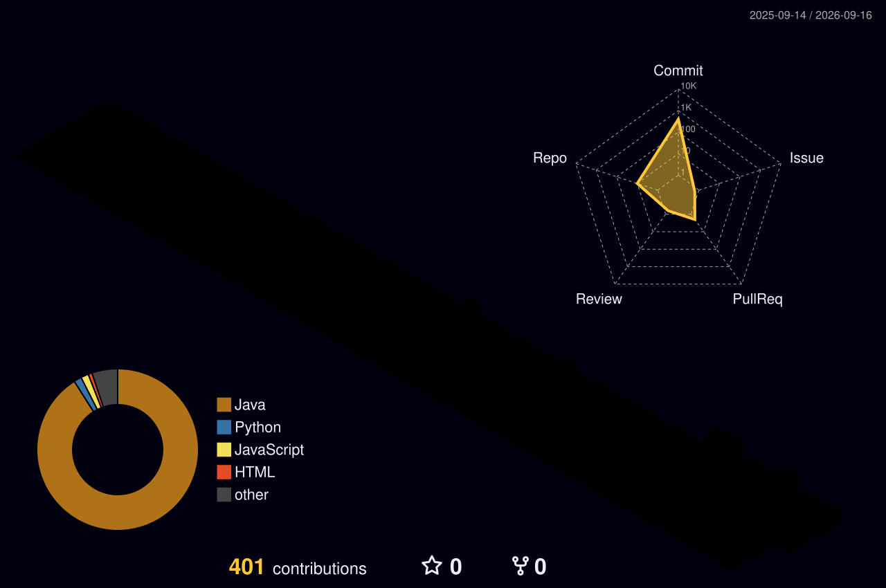

 

---

## About

I'm **Krish Verma**, a 4th-year B.Tech Information Technology student at **MIET, Meerut**.

I work with **Java, Python and SQL**, with a focus on software development, data analytics and visualization.

My repositories include coding solutions, analytics projects and development work.

---

## Languages & Tools

### Programming & Development

<table>
<tr>

<td align="center">

</td>

<td align="center">

</td>

<td align="center">

</td>

<td align="center">

</td>

<td align="center">

</td>

<td align="center">

</td>

<td align="center">

</td>

</tr>
</table>

 

### Data & Analytics

<table>
<tr>

<td align="center">

</td>

<td align="center">

</td>

<td align="center">

</td>

</tr>
</table>

---

## Featured Projects

<table>
<tr>

<td width="50%" valign="top">

<h3>Mutual Fund Risk & Return Analytics</h3>

End-to-end mutual fund analytics project using <b>Python, SQL and Streamlit</b> to analyze risk, returns, costs, fund performance and identify data-driven insights.

  

</td>

<td width="50%" valign="top">

<h3>My Daily LeetCode Solution in Java</h3>

A collection of <b>LeetCode problems implemented in Java</b>, covering coding practice and commonly used problem-solving approaches.

  

</td>

</tr>

<tr>

<td width="50%" valign="top">

<h3>My GFG Java Solutions</h3>

A collection of <b>Java solutions to GeeksforGeeks DSA problems</b>, organized by difficulty.

  

</td>

<td width="50%" valign="top">

<h3>More on GitHub</h3>

Explore the rest of my repositories, including programming practice, development work and other projects.

  

</td>

</tr>
</table>

---

## GitHub Activity

---

## 3D Contribution View

---

## Open Source

<b>Open Source Contributor</b>

  

Public repositories, coding solutions and project work are available on GitHub.

  

---

## Connect With Me

<table>
<tr>

<td align="center">

</td>

<td align="center">

</td>

<td align="center">

</td>

</tr>
</table>

  

   

<strong>Built with code, data and GitHub.</strong>

