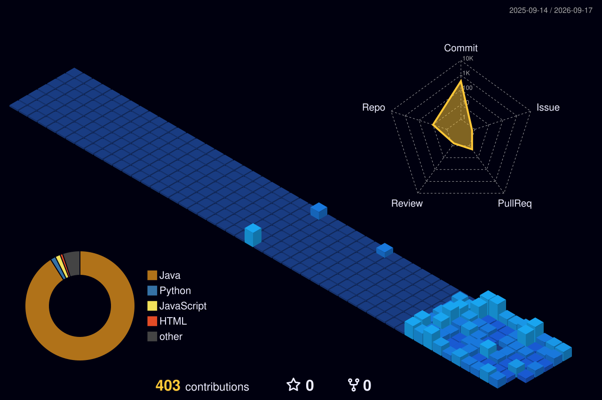

  <h1>KRISH VERMA</h1>
  <h3>B.Tech IT | 4th Year | MIET</h3>
  
  

 

## ABOUT

**Krish Verma**

4th-year B.Tech (Information Technology) student at MIET, Meerut. 

I work across software development and data analytics, with hands-on work in Java, Python, SQL, and data visualization. My GitHub includes programming solutions, data-focused projects, and applications built around practical use cases.

 

## LANGUAGES & TOOLS

  
    
  
  
  

 

## FEATURED PROJECTS

  
  
  

 

## GITHUB ACTIVITY

  
  

 

## CONTRIBUTION ACTIVITY (3D VIEW)

  

 

## OPEN SOURCE CONTRIBUTOR

I actively contribute to open-source solutions and maintain my own technical repositories. 

 

## CONNECT WITH ME

  
  
  

 

---

  Built with code, data and GitHub.
   
  

